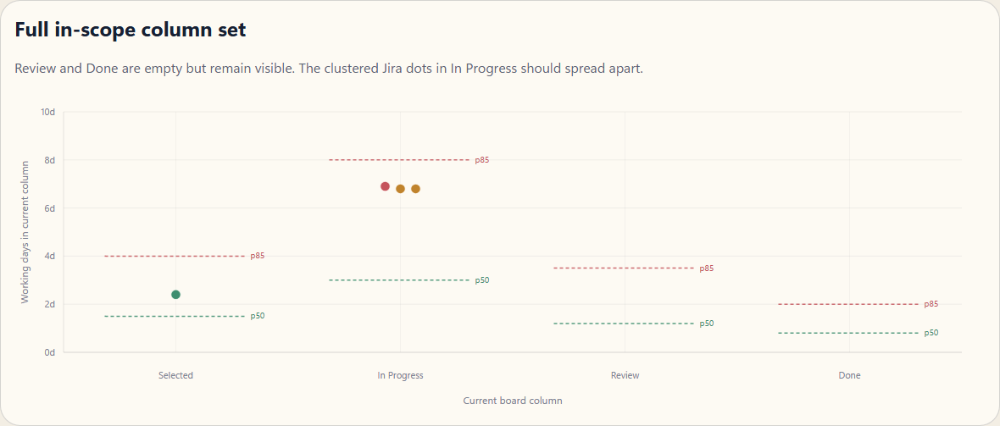
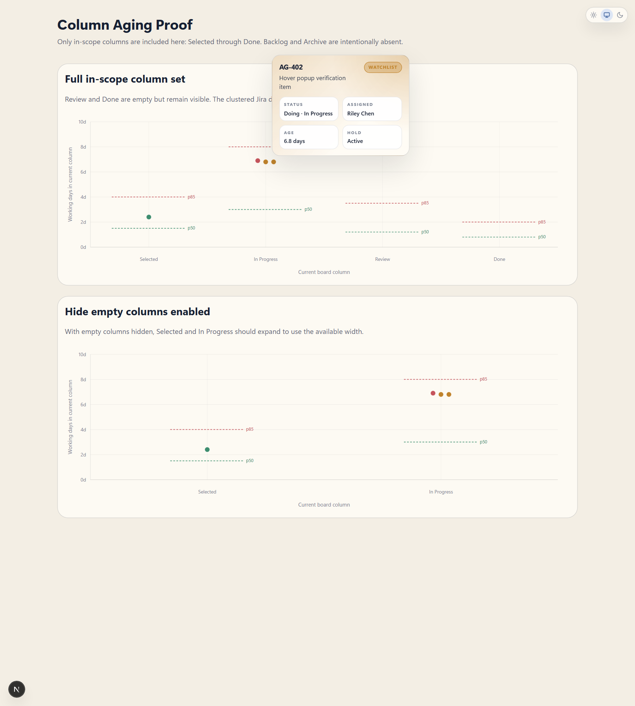
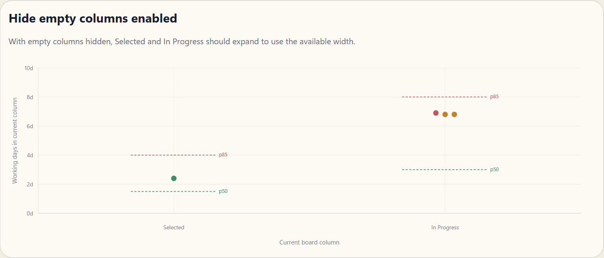

## Summary

- restore a real hover popup for the column aging chart
- limit column aging to the configured in-scope board span
- make hidden-column mode reclaim horizontal space and spread dense Jira dots apart
- add screenshot evidence under `docs/evidence/column-aging/`

## Verification

- `pnpm vitest run apps/web/src/app/api/v1/scopes/[scopeId]/flow/column-aging-scope.test.ts apps/web/src/components/flow/column-aging-scatter-plot.test.tsx apps/web/src/components/flow/flow-analytics-section.test.tsx apps/web/src/components/flow/aging-scatter-plot.test.tsx`

## Evidence

Only in-scope columns are shown: `Selected`, `In Progress`, `Review`, `Done`.

Hover popup is working on a Jira dot and shows the work item details.

When empty columns are hidden, the remaining columns expand across the available width and the clustered Jira dots have more separation.

Measured proof from `docs/evidence/column-aging/column-aging-metrics.json`:

- full visible labels: `Selected`, `In Progress`, `Review`, `Done`
- hide-empty visible labels: `Selected`, `In Progress`
- same-width chart area: `1146px`
- dot spread before hide-empty: `283`
- dot spread after hide-empty: `548`
